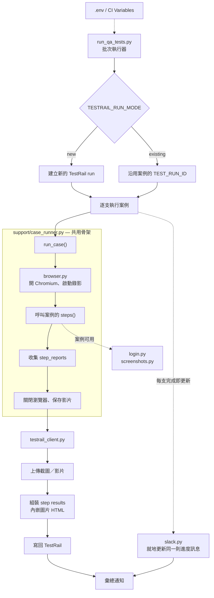

# QA Automation Portfolio

Python + Playwright 的 E2E 測試框架，整合 TestRail 結果回報、截圖／錄影附件與 Slack 通知。

測試案例只需要寫「測試步驟」本身 —— 開瀏覽器、建立截圖目錄、錄影、統一錯誤處理、
把結果連同截圖寫回 TestRail、以及執行進度通知，全部由框架處理。

```python
def steps(page, screenshot_dir, step_reports):
    login(page, "admin")
    screenshot = save_step_screenshot(page, screenshot_dir, 1, "login")
    step_reports.append(StepReport(PASSED, "AUTOTEST: passed - 登入成功", [screenshot]))
```

上面這幾行跑完，TestRail 上對應的 case 會出現一筆結果，步驟一的「實際結果」欄位裡
直接內嵌著那張截圖。

---

## 目錄

- [架構](#架構)
- [專案結構](#專案結構)
- [安裝](#安裝)
- [設定](#設定)
- [執行](#執行)
- [新增測試案例](#新增測試案例)
- [CI](#ci)
- [常見問題](#常見問題)

---

## 架構

### 設計目標

E2E 測試最容易腐化的地方，是**每支案例各自處理瀏覽器生命週期、截圖、例外和回報**。
案例一多，同樣的 try-except 和 screenshot 樣板會被複製十幾份，改一個行為要改十幾個檔案。

這套範本把那些重複收斂到一層共用骨架，讓案例檔案裡**只剩下業務步驟**。

### 執行流程



### 分層職責

| 層 | 檔案 | 負責 | 不負責 |
| --- | --- | --- | --- |
| 批次執行 | `run_qa_tests.py` | 解析設定、挑選案例、管理 TestRail run、Slack 進度 | 不碰瀏覽器 |
| 共用骨架 | `support/case_runner.py` | 瀏覽器生命週期、截圖目錄、例外攔截、結果回報 | 不知道任何業務步驟 |
| 測試案例 | `tests/test_case_*.py` | 只寫業務步驟與斷言 | 不開瀏覽器、不處理例外、不呼叫 TestRail |
| 站台適配 | `support/login.py`、`test_env.py` | 登入流程、環境與帳密解析 | 不知道測哪些功能 |
| 外部整合 | `testrail_client.py`、`slack.py` | API 呼叫、重試、附件上傳、訊息組裝 | 不知道測試怎麼跑 |

### 關鍵設計決策

**1. `step_reports` 用 append 而非 return**

```python
def steps(page, screenshot_dir, step_reports):
    step_reports.append(StepReport(PASSED, "...", [screenshot]))   # 不是 return
```

案例在第 3 步爆掉時，若採 `return`，前 2 步的結果會跟著例外一起消失，TestRail 上
只會看到「整個 case 失敗」而不知道走到哪裡。改成往呼叫端傳入的 list append，
骨架在 `except` 區塊裡仍握有已完成的結果，能精確回報「1、2 通過，3 失敗」。

**2. 未執行的步驟自動補 BLOCKED**

第 3 步失敗後，第 4、5 步根本沒跑。留白會讓人以為漏測，標成 FAILED 又是謊報。
`run_case()` 會把它們補成 BLOCKED 並註明「因前一步失敗而未執行」，
讓 TestRail 上的狀態與實際情況一致。

**3. 截圖內嵌到步驟，而非掛在整筆結果下**

`StepReport.attachments` 裡的圖片會先上傳取得 attachment id，再組成 `` 標籤
寫進**該步驟**的實際結果欄位。看報告的人不必在一堆附件裡猜哪張對應哪一步。

**4. 憑證只從環境變數讀，程式碼內沒有預設值**

`load_config_from_env()` 三個欄位都是 `required=True`，缺少時直接報出變數名稱。
沒有「預設值」可以退回，也就沒有把憑證寫死進版控的機會。

**5. `.env` 不覆蓋既有環境變數**

`load_dotenv()` 只在該 key 尚未存在時才寫入。本機讀 `.env`，CI 讀 CI Variables，
同一份程式碼不需要分支判斷自己跑在哪裡。

**6. 角色與環境都不寫死**

登入變數採 `{角色}_{環境}_{欄位}` 命名。切換環境只改 `TEST_ENV`；
新增角色只要在 `.env` 補一組同前綴的變數，共用模組一行都不用改。

---

## 專案結構

| 路徑 | 說明 |
| --- | --- |
| `run_qa_tests.py` | 批次執行器：挑選案例、建立 TestRail run、推送 Slack 進度。 |
| `testrail_client.py` | TestRail API client、重試、附件上傳、step result 組裝。 |
| `slack.py` | Slack 進度與結果通知（Webhook 與 Bot Token 兩種發送方式）。 |
| `tests/` | 測試案例。每支提供 `CASE_ID`、`TEST_RUN_ID` 與 `steps()`。 |
| `tests/test_case_sample.py` | 最小範例：登入後回報一個步驟。 |
| `tests/test_case_example_multi_step.py` | 完整範例：多步驟、逐步截圖、FAILED 與中止後續步驟。 |
| `support/case_runner.py` | 共用執行骨架 `run_case()`。 |
| `support/browser.py` | 建立 Chromium page、錄影與影片保存。 |
| `support/login.py` | 登入流程；需依站台調整的 selector 集中在檔案開頭。 |
| `support/test_env.py` | 依 `TEST_ENV` 解析各角色的登入資料。 |
| `support/screenshots.py` | 截圖路徑建立與保存。 |
| `examples/ci/github-actions-e2e.yml.example` | GitHub Actions 展示範例；不會被 GitHub 載入或執行。 |
| `.gitlab-ci.yml` | GitLab CI 參考範例（本專案託管於 GitHub，此檔不會被執行）。 |
| `IMG/` | 截圖與錄影輸出（執行時自動產生，已 gitignore）。 |

---

## 安裝

```powershell
python -m venv .venv
.\.venv\Scripts\python.exe -m pip install -r requirements.txt
.\.venv\Scripts\python.exe -m playwright install chromium
```

建立自己的 `.env`：

```powershell
Copy-Item .env.example .env
```

---

## 設定

所有設定都在 `.env`（本機）或 CI Variables（CI）。`.env` 已被 gitignore。

### TestRail 連線（必填）

```env
TESTRAIL_URL=https://your-org.testrail.io/
TESTRAIL_USER=your-testrail-account@example.com
TESTRAIL_API_KEY=your-testrail-api-key
TESTRAIL_PROJECT_ID=1
```

程式碼內沒有任何預設值，缺少時直接報 `Missing environment variable: TESTRAIL_URL`。

### 執行模式

```env
TESTRAIL_RUN_MODE=new
TESTRAIL_TESTS=["test_case_sample"]
RUN_TIMEZONE=Asia/Taipei
```

| 值 | 行為 | 適用 |
| --- | --- | --- |
| `new` | 每次執行建立一個新的 TestRail run | 排程的每日巡檢 |
| `existing` | 不建立 run，沿用每支案例自己的 `TEST_RUN_ID` | 針對特定 run 補跑 |

舊版的數字寫法（`2` = existing、`3` = new）仍可使用。

`TESTRAIL_TESTS` 是 JSON 陣列，三種寫法都接受：

- `CASE_ID`，例如 `6540`
- `TEST_RUN_ID`
- 檔名，例如 `"test_case_sample"` 或 `"test_case_sample.py"`

需要讓兩種模式各跑不同案例時，可另外指定 `TESTRAIL_TESTS_NEW` /
`TESTRAIL_TESTS_EXISTING`；未設定則沿用 `TESTRAIL_TESTS`。

### 受測站台登入資料

變數採 `{角色}_{環境}_{欄位}` 命名：

```env
TEST_ENV=QA

ADMIN_QA_LOGIN_URL=https://qa.example.com/login
ADMIN_QA_USERNAME=your-qa-username
ADMIN_QA_PASSWORD=your-qa-password

ADMIN_STAGE_LOGIN_URL=https://stage.example.com/login
ADMIN_STAGE_USERNAME=your-stage-username
ADMIN_STAGE_PASSWORD=your-stage-password
```

**切換環境** —— 只改一個變數，整組帳密跟著換：

```env
TEST_ENV=STAGE
```

**新增角色** —— 在 `.env` 補一組同格式的變數，共用模組不用改：

```env
USER_QA_LOGIN_URL=https://qa.example.com/login
USER_QA_USERNAME=...
USER_QA_PASSWORD=...
```

```python
login(page, "user")     # 對應 USER_{TEST_ENV}_*
```

環境名稱不限於 `QA` / `STAGE`；設 `TEST_ENV=PROD` 就會去找 `ADMIN_PROD_*`。

### Slack 通知（選用）

```env
SLACK_NOTIFY_ENABLED=true
SLACK_WEBHOOK_URL=          # 最終結果通知
SLACK_BOT_TOKEN=            # 進度訊息就地更新用（xoxb-...）
SLACK_CHANNEL_ID=           # 進度訊息發送的頻道
SLACK_PROGRESS_INTERVAL_SECONDS=10
```

只填 `SLACK_WEBHOOK_URL` 也能運作，差別在於每次更新是一則新訊息；
補上 `SLACK_BOT_TOKEN` + `SLACK_CHANNEL_ID` 才會就地更新同一則。

### 其他

| 變數 | 預設 | 說明 |
| --- | --- | --- |
| `TESTRAIL_REPORT_ENABLED` | `true` | 設 `false` 只跑流程不回報，本機驗證用 |
| `TESTRAIL_RECORD_VIDEO` | `false` | 錄影，失敗時附到結果 |
| `TESTRAIL_VERBOSE` | `false` | 較詳細的 console log |
| `RUN_TIMEZONE` | `UTC` | run 名稱時間戳的時區 |

---

## 執行

```powershell
# 依 .env 設定批次執行
.\.venv\Scripts\python.exe run_qa_tests.py

# 只跑流程不回報 TestRail
.\.venv\Scripts\python.exe run_qa_tests.py --dry-run

# 指定 run 名稱
.\.venv\Scripts\python.exe run_qa_tests.py --name "Daily Auto Check - 2026-01-01"

# 單獨執行某一支案例
.\.venv\Scripts\python.exe tests\test_case_sample.py --dry-run
```

---

## 新增測試案例

複製 `tests/test_case_sample.py`，改成自己的 `CASE_ID` / `TEST_RUN_ID`，
在 `steps()` 裡寫測試流程：

```python
from support.case_runner import run_case
from support.login import login
from support.screenshots import save_step_screenshot
from testrail_client import PASSED, StepReport

CASE_ID = 0
TEST_RUN_ID = 0


def steps(page, screenshot_dir, step_reports):
    login(page, "admin")
    screenshot = save_step_screenshot(page, screenshot_dir, 1, "login")
    step_reports.append(
        StepReport(PASSED, "AUTOTEST: passed - 登入成功", [screenshot])
    )


if __name__ == "__main__":
    raise SystemExit(run_case(CASE_ID, TEST_RUN_ID, steps))
```

重點：

- `steps()` 收到 `(page, screenshot_dir, step_reports)`，往 `step_reports` **append**
  而非 `return`（理由見[關鍵設計決策](#關鍵設計決策)）。
- `step_reports` 的第 N 筆對應 TestRail case 的第 N 個步驟，順序要一致。
- 例外處理不用自己寫，`run_case()` 會統一截圖、錄影並補上 `FAILED`。
- 需要提前中止時呼叫 `abort_remaining_steps(step_reports)`，未執行步驟自動補 `BLOCKED`。
- `TEST_RUN_ID <= 0` 視為 dry run。

`StepReport` 欄位：

| 欄位 | 說明 |
| --- | --- |
| `status_id` | `PASSED`、`FAILED`、`BLOCKED` |
| `actual` | 寫入 TestRail 的執行結果文字 |
| `attachments` | 截圖或影片路徑 list，不附檔傳 `[]`。圖片內嵌到步驟，其他檔案掛在整筆 result |

完整用法見 [tests/test_case_example_multi_step.py](tests/test_case_example_multi_step.py)。

### 產生 selector

```powershell
.\.venv\Scripts\playwright.exe codegen --viewport-size="1920,1080" "https://example.com/login"
```

---

## CI

本專案目前是作品展示用途，**沒有啟用 GitHub Actions**，不會定時或手動執行線上測試。
CI 設計仍以不會被 GitHub 載入的範例檔保留：

| | [GitHub Actions 範例](examples/ci/github-actions-e2e.yml.example) | [GitLab CI 範例](.gitlab-ci.yml) |
| --- | --- | --- |
| 設定檔位置 | `examples/ci/*.example` | `.gitlab-ci.yml`（根目錄） |
| 機密存放 | Settings → Secrets and variables → Actions | Settings → CI/CD → Variables（勾 Masked） |
| 快取 | `actions/cache` action | `cache:` 關鍵字 |
| 產物 | `actions/upload-artifact` action | `artifacts:` |
| 本專案狀態 | 展示範例，**不會執行** | 參考範例，GitHub 不會讀取 |

兩者流程相同：安裝依賴 → 安裝 Chromium → `xvfb-run` 執行 → 保存 `IMG/` 產物。
**憑證一律走平台的機密管理，不要寫進 yml。**

### GitHub Actions

[examples/ci/github-actions-e2e.yml.example](examples/ci/github-actions-e2e.yml.example)
展示每日排程與手動觸發的完整設計，但因為不在 `.github/workflows/` 目錄內，GitHub 不會識別或執行它。範例流程為：

1. 安裝依賴（pip 快取）
2. 安裝 Chromium，瀏覽器本體另外快取 —— 約 115 MB，不快取的話每次執行都要重新下載
3. 以 `xvfb-run` 執行 `run_qa_tests.py`（headed 模式在無桌面的 runner 上需要虛擬顯示器）
4. 上傳 `IMG/` 的截圖與錄影

第 4 步用 `if: always()` —— 失敗時的截圖正是最需要看的東西，不能因為前一步失敗就不上傳。

若日後將範例移回 `.github/workflows/e2e.yml` 啟用，手動觸發時可以選擇測試環境與要執行的案例。
同一分支重複觸發時，`concurrency` 會取消還在跑的舊 job，避免兩份測試同時打同一個站台。

測試失敗時 `run_qa_tests.py` 會以非零 exit code 結束，job 因此正確標記為紅燈。

#### 機密設定

Settings → Secrets and variables → Actions：

**Secrets**（加密，log 中自動遮蔽）

```text
TESTRAIL_URL              TESTRAIL_USER            TESTRAIL_API_KEY
SLACK_WEBHOOK_URL         SLACK_BOT_TOKEN          SLACK_CHANNEL_ID
ADMIN_STAGE_LOGIN_URL     ADMIN_STAGE_USERNAME     ADMIN_STAGE_PASSWORD
```

**Variables**（非機密）

```text
TESTRAIL_PROJECT_ID
```

工作流程刻意不掛在 `pull_request` 事件上：來自 fork 的 PR 讀不到 secrets，掛上去只會固定失敗。

### GitLab CI

[.gitlab-ci.yml](.gitlab-ci.yml) 是同一套流程在 GitLab runner 上的寫法，
搬到 GitLab 可直接沿用。需要建立的 CI/CD Variables 清單寫在該檔案的註解裡。
放在 GitHub 上不會被執行，純作對照參考。

---

## 常見問題

### Playwright 找不到 Chromium

```text
BrowserType.launch: Executable doesn't exist
```

執行 `.\.venv\Scripts\python.exe -m playwright install chromium`。

### `Missing environment variable: TESTRAIL_URL`

`.env` 沒建立或沒填 TestRail 連線資訊。本機只想跑流程不回報時，
用 `--dry-run` 或設 `TESTRAIL_REPORT_ENABLED=false`。

### `TEST_RUN_ID = 0` 無法回報 TestRail

不是 dry-run 時需要有效的 run id。解法：改案例的 `TEST_RUN_ID`、
執行時加 `--run-id <id>`、或本機驗證時用 `--dry-run`。

### `RUN_TIMEZONE` 設了卻沒作用

Windows 與精簡版 Linux 映像沒有內建 IANA 時區資料庫。`requirements.txt` 已包含
`tzdata` 套件，確認它有裝好；無法解析時會印出警告並退回 UTC，不會中斷執行。

### 修改 `.env` 後沒有生效

`.env` 只在該 key 尚未存在於環境變數時才載入（讓 CI Variables 優先）。
修改後請重新執行。

---

## License

[MIT](LICENSE)
